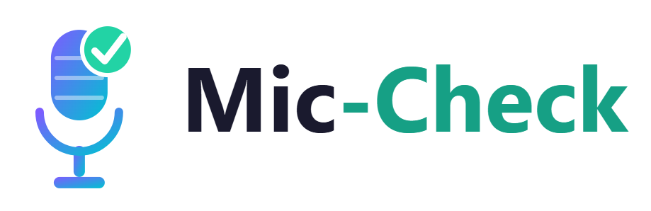

<div align="center">
  
  <h1>Mic Check</h1>
  <p>
    <strong>The Perfect Presentation </strong>
  </p>
</div>

### Authors
<div align="center">
  <table>
    <tr>
      <th>Name</th>
      <th>DPN</th>
      <th>LinkedIn</th>
      <th>Role</th>
    </tr>
    <tr>
      <td>Venn Reddy</td>
      <td><a href="https://people.deloitte/profile/vreddy5">DPN</a></td>
      <td><a href="https://www.linkedin.com/in/venn-reddy">LinkedIn</a></td>
      <td>Security Engineer I</td>
    </tr>
    <tr>
      <td>Thomas Huo</td>
      <td><a href="https://people.deloitte/profile/thohuo">DPN</a></td>
      <td><a href="https://www.linkedin.com/in/thomas-huo-7899b9239/">LinkedIn</a></td>
      <td>Cloud Integrated Engineer I</td>
    </tr>
  </table>
</div>

---

## 🚀 Getting Started

### Prerequisites
- **Windows**, with a licensed, installed copy of **Microsoft PowerPoint** — slide rendering drives PowerPoint directly via COM automation, so this can't be `pip install`ed away.
- **Python 3.11+** on your `PATH`.
- An **Anthropic API key** — ask Venn or Thomas for one internally; it's not checked into this repo.

> First-time use of the rehearsal review flow downloads a small Whisper speech-to-text model from Hugging Face, so make sure you have internet access (through the corporate proxy is fine) the first time you record a rehearsal.

### Option A — Manual setup
1. Install dependencies:
   ```bash
   pip install -r backend/requirements.txt
   ```
2. Copy `backend\.env.example` to `backend\.env` and paste in your Anthropic API key:
   ```
   ANTHROPIC_API_KEY=your-key-here
   ```
3. Run the app and open it in your browser:
   ```bash
   python backend\app.py
   ```
   Then go to **http://localhost:5000**.

### Option B — Scripted setup
Two PowerShell scripts at the repo root do the above for you:

```bash
.\install.ps1   # run once — creates a venv, installs dependencies, prompts for your API key
.\start.ps1     # run each time you want to use the app — opens the browser automatically
```

If PowerShell blocks the scripts from running (execution policy), use:
```bash
powershell -ExecutionPolicy Bypass -File install.ps1
```

---

## 🎙️ Why Mic Check?
*Purpose & What it Does*

Dry runs are an important part of big deliverables. Mic Check is the presentation tool that helps practitioners quality check source information, practice their talk tralks, and gain real-time feedback on the content, narrative, and actual presentation of their decks. 


Mic Check runs its review against **your own deck and your own rehearsal**, and not generic pitch-deck advice. It cares about three things:

1. **Source Consistency**: does every number or claim on a slide actually tie back to the supporting Excel model and context documents?
2. **Narrative Quality**: does each slide's headline follow from its content, is the "so what" clear, and does the story arc hold together end to end?
3. **Talk Track Fidelity**: does what you actually *said* match the slide content and the deck's narrative?

### Key Features
1. **PPTX Upload & Slide Rendering**: Drop in a deck and Mic Check extracts each slide's text/notes and renders it as an image so Claude can actually "see" it.
2. **Optional Source Documents**: Attach supporting Excel models and/or PDF/text context docs — every number on your slides gets checked against them. Useful for projects with lots of research off the slides.
3. **In-Browser Rehearsal Recording**: Present your deck out loud right in the browser. Next/Prev clicks are captured as timestamps, no separate screen recorder needed.
4. **Local Speech-to-Text + Delivery Metrics**: Your rehearsal audio is transcribed and analyzed locally using the librosa library to review pace, filler words, pauses, pitch/volume per slide.
5. **Structured Critique**: See structured reviews and comments covering source consistency, narrative quality, and talk-track fidelity, slide by slide, powered by librosa's audio engine and the Claude API.

---

## 🛠️ How We Built It
*How is Mic Check implemented?*

Mic Check is intentionally lightweight: a single Flask app serves both the API and a vanilla JS frontend, backed by an in-memory session store instead of a database.

### Functional Implementation

The UI is a straightforward 3-step flow:

**1. Upload** — you upload a `.pptx` deck (required), and optionally a `.xlsx` supporting model and PDF/TXT context documents. The backend extracts each slide's title, body, and speaker notes with `python-pptx`, renders every slide to a PNG via PowerPoint COM automation, and flattens the Excel model into a plain-text summary.

**2. Present** — you click through the rendered slides while recording yourself out loud in the browser. Every Next/Prev click is stamped with a timestamp, which is all the segmentation Mic Check needs to know which words belong to which slide.

**3. Results** — the recording and timestamps are sent to the backend, which decodes the audio once and reuses it for both `faster-whisper` transcription (word-level timestamps) and `librosa` pitch/volume/pause analysis, sliced per slide using the timestamps from the Present step. Everything — slide text, slide images, the Excel summary, context docs, and per-slide transcript + delivery metrics — is bundled into a single Claude call. Claude is system-prompted as a "meticulous, skeptical engagement manager" and returns one structured critique: an overall summary, a narrative-arc assessment, and per-slide consistency flags, narrative notes, talk-track notes, and (only when genuinely notable) delivery notes.

To try this end-to-end, ready-made samples are already included under [`backend/sample/`](backend/sample/) so you can watch the consistency checks catch real discrepancies on the very first run.

### Tech Stack

#### Backend - Core
| Technology | Use Case |
| :--- | :--- |
| Flask | Runs the API and serves the static frontend directly — no separate frontend server, since this is a single-session local tool rather than a hosted multi-user product. |
| python-dotenv | Loads the Anthropic API key from `backend/.env` at startup. |

#### AI & Audio
| Technology | Use Case |
| :--- | :--- |
| Anthropic Claude (`claude-sonnet-5`) | Reads the deck text and slide images, source documents, and per-slide talk track/delivery metrics in one call, and returns the structured critique. |
| faster-whisper | Local, offline speech-to-text transcription of the rehearsal recording, with word-level timestamps. |
| librosa | Computes pitch (`pyin`), volume (RMS), and pause/silence detection from the raw audio to produce delivery metrics per slide. |

#### Document Processing
| Technology | Use Case |
| :--- | :--- |
| python-pptx + PowerPoint COM automation (pywin32) | Extracts slide text/notes and renders each slide to a PNG via a local PowerPoint install. |
| openpyxl | Flattens an optional supporting Excel model into a plain-text summary Claude can reason over. |
| pypdf | Extracts text from optional PDF context documents. |

#### Frontend
| Technology | Use Case |
| :--- | :--- |
| Vanilla HTML/CSS/JavaScript | A small, dependency-free 3-step UI (upload → present & record → results) served directly by Flask — no framework needed at this scope. |
| MediaRecorder Web API | Captures the in-browser rehearsal recording and the slide-navigation timestamps used to segment the audio per slide. |

